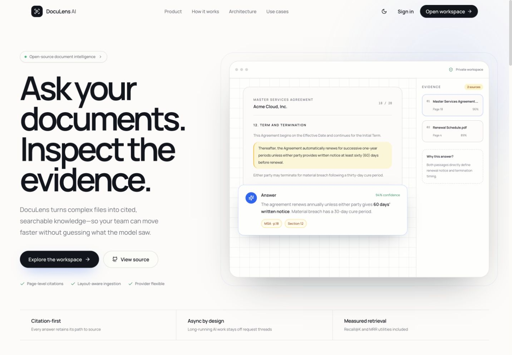
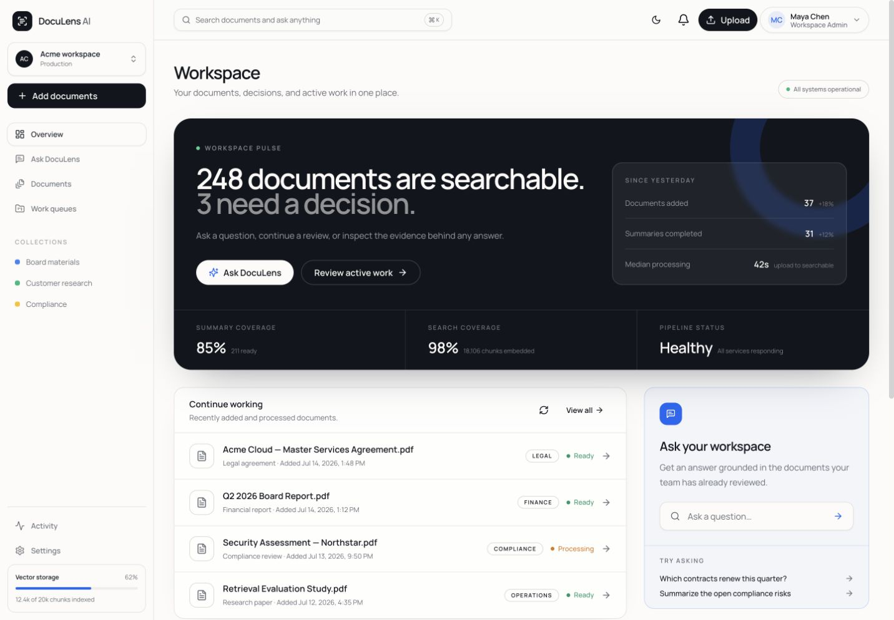
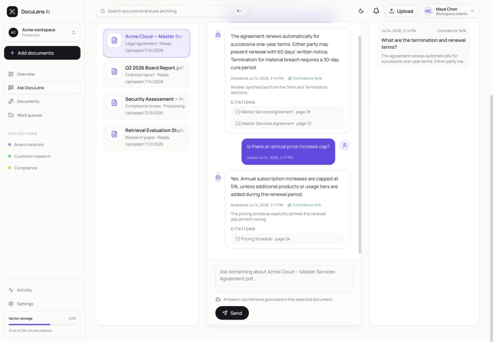
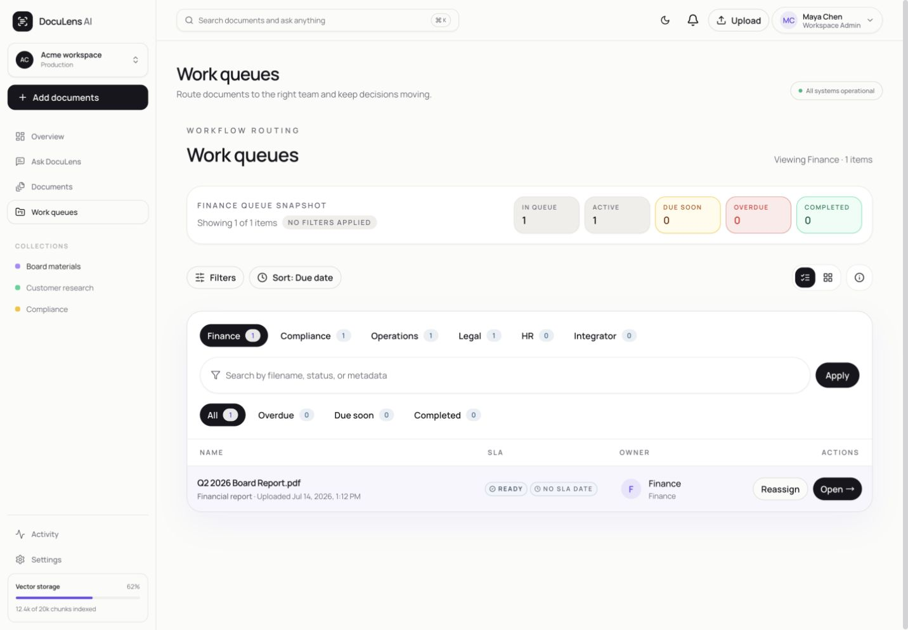
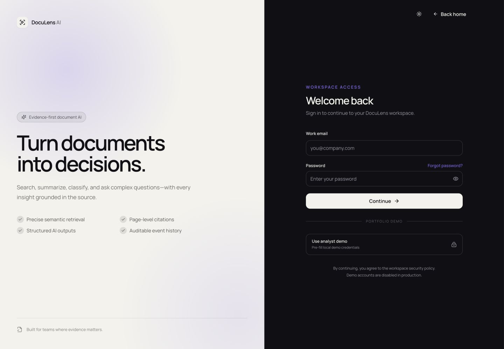
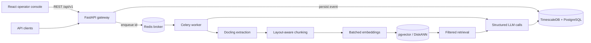

# DocuLens AI

**Turn unstructured business documents into searchable, cited, operational knowledge.**

DocuLens is an open-source document intelligence system for teams that need more than a chat-with-PDF demo. It accepts documents asynchronously, extracts layout-aware content, creates citation-ready embeddings, and exposes classification, summarization, semantic search, and grounded question answering through a versioned API and an operator console.

[](https://github.com/codewithmoin/doculens-ai/actions/workflows/backend-ci.yml)
[](https://www.python.org/)
[](https://fastapi.tiangolo.com/)
[](LICENSE)
[](https://doculens-ai.pages.dev/)

**[Explore the live showcase →](https://doculens-ai.pages.dev/)** No sign-in required. The hosted workspace is read-only and uses clearly labelled synthetic data.

## Why it is technically interesting

- **Layout-aware ingestion:** Docling preserves headings, tables, provenance, and page numbers instead of flattening a document into one string.
- **Asynchronous AI workflows:** FastAPI accepts work quickly; Celery executes extraction and model calls with bounded task time, late acknowledgement, and worker-loss recovery.
- **Citation-first RAG:** every vector carries document, chunk, page, title, and token metadata; QA prompts use stable references and require grounded answers.
- **Measurable retrieval:** dependency-free Recall@K and MRR utilities make retrieval changes testable against labelled fixtures.
- **Operational product surface:** the React console covers intake, work queues, QA history, labels, lifecycle actions, and dashboard insights.

## Product tour



The redesigned experience separates the public product story from a focused authenticated workspace. Inside the app, teams get global `⌘K` search, drag-and-drop ingestion, collection-aware document navigation, work queues, processing visibility, and an evidence-first AI chat with source references.



<details>
<summary>View the evidence-first QA studio and work queues</summary>





</details>

<details>
<summary>View the workspace sign-in experience</summary>



</details>

## Architecture



The event record is the durable boundary between HTTP and AI work. A worker validates the stored event, selects a typed pipeline from the registry, runs its nodes, and stores a serializable task context. This design keeps slow or retryable model work away from request threads while retaining an auditable input/output trail.

## Capabilities

- PDF and text ingestion with layout-aware extraction
- document classification and configurable label hierarchies
- structured information extraction
- document summaries with source chunk provenance
- metadata-filtered semantic and keyword search
- retrieval-augmented QA with stable citations and confidence
- archive, restore, and soft-delete lifecycle operations
- JWT personas plus optional API-key protection
- work queues, notifications, dashboards, and request history
- OpenAI, Anthropic, OpenRouter, and local OpenAI-compatible model adapters

## Stack

| Layer | Technology | Responsibility |
| --- | --- | --- |
| API | FastAPI, Pydantic, SQLAlchemy | contracts, validation, authentication, persistence |
| Jobs | Celery, Redis | resilient long-running document and AI processing |
| Retrieval | Docling, tiktoken, OpenAI embeddings | extraction, bounded chunks, batched embeddings |
| Data | PostgreSQL, Timescale Vector, pgvector | events, metadata, keyword and vector search |
| Models | Instructor, OpenAI, Anthropic | provider-neutral structured outputs |
| Web | React 19, TypeScript, Vite, TanStack Query | operator workflows and evidence review |
| Quality | pytest, Ruff, Pyright, pre-commit, GitHub Actions | repeatable engineering checks |

## Quick start

### Prerequisites

- Docker with Compose v2
- an OpenAI API key (required for embeddings; model providers are configurable)
- Python 3.11+ and Node 20+ only when running services outside Docker

```bash
git clone https://github.com/codewithmoin/doculens-ai.git
cd doculens-ai
cp .env.example .env
# Set OPENAI_API_KEY and replace DOCULENS_AUTH_SECRET in .env
make up
```

Open:

- console: `http://localhost:5173`
- OpenAPI: `http://localhost:8080/docs`
- liveness: `http://localhost:8080/health/live`

Schema migrations should be applied with Alembic for deployments. Automatic table initialization is a local-development convenience and can be disabled with `DOCULENS_INITIALIZE_DATABASE=false`. Demo users are opt-in via `DOCULENS_SEED_DEMO_USERS=true` and are explicitly rejected in production.

### Publish the portfolio showcase

DocuLens includes a separate single-node deployment for a public, read-only product tour. It serves the frontend and API from one HTTPS domain, seeds synthetic documents idempotently, skips the worker, and blocks every state-changing workspace request in the API.

```bash
cp .env.showcase.example .env.showcase
# Set the domain and generated secrets, then:
make showcase-up
```

See the [showcase deployment runbook](docs/deploy-showcase.md) for DNS, TLS, verification, backups, and rollback. This mode demonstrates the finished AI workflow without accepting public uploads or spending money on visitor model calls.

## API examples

All stable endpoints are under `/api/v1`. Legacy `/events` routes remain available for existing clients.

Upload a document:

```bash
curl --fail-with-body http://localhost:8080/api/v1/events/documents/upload \
  -H "X-API-Key: $DOCULENS_API_KEY" \
  -F "file=@data/sample/example.txt" \
  -F "doc_type=invoice" \
  -F 'metadata={"source":"quickstart","department":"finance"}'
```

Ask a grounded question:

```bash
curl --fail-with-body http://localhost:8080/api/v1/events/ \
  -H 'Content-Type: application/json' \
  -H "X-API-Key: $DOCULENS_API_KEY" \
  -d '{"event_type":"qa_query","query":"What is the invoice total?","top_k":5}'
```

The API returns `202 Accepted` with an event id. Poll the event resource until its task context contains the answer and `chunk_references` used to construct it. Ready-made payloads live in [`requests/events`](requests/events).

## Configuration

Configuration is validated once at startup. See [`.env.example`](.env.example) for the full local template.

| Variable | Default | Purpose |
| --- | ---: | --- |
| `DOCULENS_ENVIRONMENT` | `development` | enables production safety checks |
| `DOCULENS_CORS_ORIGINS` | localhost console | JSON list of allowed browser origins |
| `DOCULENS_MAX_UPLOAD_BYTES` | 25 MiB | streamed upload limit |
| `DOCULENS_CHUNK_MAX_TOKENS` | 800 | retrieval chunk size |
| `DOCULENS_EMBEDDING_BATCH_SIZE` | 64 | provider request batch bound |
| `DOCULENS_EMBEDDING_CACHE_SIZE` | 1024 | process-local repeated-text cache |
| `DOCULENS_PROVIDER_TIMEOUT_SECONDS` | 30 | AI provider network timeout |
| `DOCULENS_QA_TOP_K` | 5 | default QA retrieval breadth |
| `DOCULENS_SHOWCASE_READ_ONLY` | false | blocks workspace mutations and enables the public product-tour UX |

## Development

```bash
make install       # backend editable install + npm ci
make check         # lint, types, frontend build, tests
pre-commit install # run fast checks before each commit
```

Useful commands are discoverable with `make help`. CI runs the same Ruff, Pyright, pytest, and coverage checks used locally.

### Retrieval evaluation

Create labelled `RetrievalExample` cases with known relevant chunk ids and run `evaluate(examples, k=5)`. Track Recall@5 and MRR before changing chunk size, embedding model, filters, or ranking. The utility is intentionally offline and deterministic: it belongs in CI; live provider quality and latency belong in a separate scheduled benchmark.

## Project structure

```text
app/
├── api/             HTTP contracts, auth, dependencies, versioned routers
├── config/          validated runtime and infrastructure settings
├── core/            pipeline primitives and observability
├── database/        SQLAlchemy models, repositories, migrations
├── doc_utils/       extraction, chunking, embedding, retrieval
├── evaluation/      offline RAG quality metrics
├── pipelines/       typed document and QA workflows
├── prompts/         reviewed, versionable Jinja prompt assets
├── services/        domain and external-provider adapters
└── tasks/           durable Celery task entrypoints
frontend/            React/TypeScript operator console
docker/              API, worker, proxy, database, and Redis stack
tests/               API, pipeline, dashboard, and evaluation tests
requests/            executable example payloads
```

## Engineering decisions and tradeoffs

- **Modular monolith:** one deployable backend keeps contribution and operations simple. Service boundaries are internal and can be extracted only if scaling evidence demands it.
- **Async jobs, synchronous pipeline nodes:** document work is asynchronous at the system boundary; node code stays easy to reason about because most provider SDKs and extraction libraries are synchronous. Worker concurrency supplies parallelism.
- **Process-local embedding cache:** avoids repeated provider calls without introducing another consistency-sensitive cache. It resets on deploy and is not intended as durable storage.
- **Provider-neutral structured outputs:** improves validation and portability, but provider behavior still differs and must be evaluated per model.
- **Compatibility versioning:** `/api/v1` is canonical while legacy routes remain during migration. Removing aliases is a future breaking release.
- **Product hierarchy over dashboard density:** the public landing page explains the problem and architecture; `/app` is reserved for focused document work. The UI uses route-level code splitting, a paper-and-ink system with cobalt focus and amber evidence, persistent dark mode, and reduced-motion fallbacks instead of a large animation runtime.

More detail is recorded in [`docs/engineering-notes.md`](docs/engineering-notes.md) and the [`design system specification`](docs/design-system.md).

## Limitations

- OCR/model accuracy depends on document quality, language, and provider.
- The current retrieval path is dense-first; hybrid ranking exists but needs a labelled corpus before tuning.
- The included deployment manifest is deliberately scoped to a single-node, read-only portfolio showcase—not a multi-tenant customer environment.
- Authentication is suitable for a single workspace; multi-tenant authorization is not implemented.
- Retrieval metrics are utilities, not a bundled benchmark dataset—the project does not claim quality without domain-labelled examples.

## Roadmap

- persist event lifecycle states and retry diagnostics as first-class columns
- add a small, redistributable labelled retrieval benchmark
- evaluate reciprocal-rank fusion for dense + keyword retrieval
- add OpenTelemetry traces and provider latency/cost dashboards
- split the large legacy event endpoint module by resource as routes stabilize
- publish signed, multi-stage container images and a deployment runbook

## Security

Never commit provider keys or production documents. Configure explicit CORS origins, API authentication, a strong `DOCULENS_AUTH_SECRET`, database TLS, and object storage for uploads in deployed environments. Report vulnerabilities privately through GitHub security advisories.

## License

DocuLens AI is available under the [MIT License](LICENSE).
